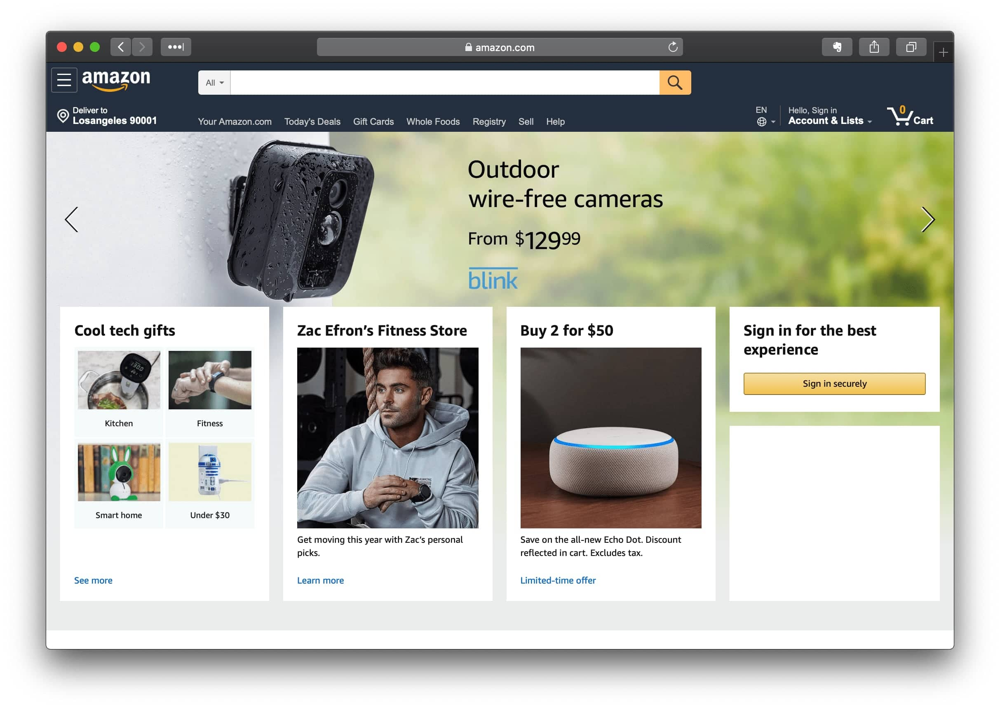

# NothingBlock

> “You know you've achieved perfection in design, not when you have nothing more to add, but when you have nothing more to take away.” ― Antoine de Saint-Exupéry

NothingBlock blocks nothing important to have "nothing more to take away".

## How to Use

Add `https://raw.githubusercontent.com/sayomelu/NothingBlock/develop/NothingBlock.txt` to your [ad blocker](https://bing.com/search?q=ad+blocker) to use all filter lists.

If you want to add a specific site, you can copy the filter and paste it to your [ad blocker](https://bing.com/search?q=ad+blocker) filter list.

---

## Supported Website

### Entertainment

* [bilibili](Filter/Entertainment/bilibili.txt) (2019.1.19)

### News

* [Inoreader](Filter/News/Inoreader) (2019.1.14)

### Productivity

* [Evernote](Filter/Productivity/Evernote) (2019.1.14)

### Shopping

* [Alibaba](Filter/Shopping/Taobao.txt) (2019.1.19)
* [Amazon](Filter/Shopping/Amazon.txt) (2019.1.14)
* [JD](Filter/Shopping/JD.txt) (2019.1.19)

---

## Support

Create an [issue](https://github.com/sayomelu/NothingBlock/issues/new) on GitHub to ask for support, or chat with other users on [Telegram Group](https://t.me/NothingBlockGroup).

### Build by Sayo with ❤️